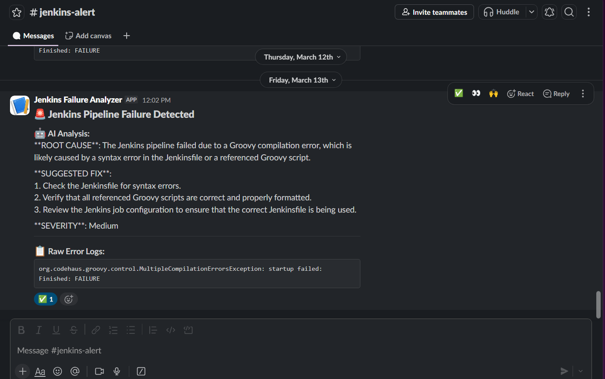
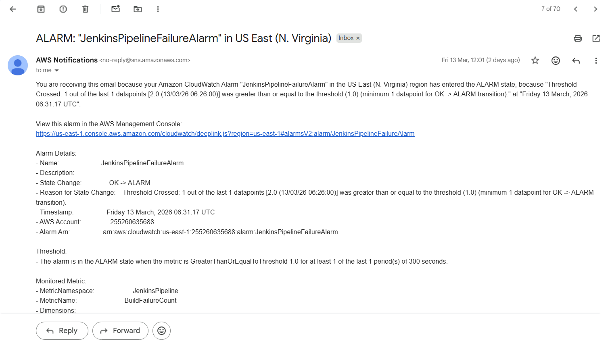

# AI-Powered CI/CD Failure Analyzer 🤖

> A production-grade Jenkins CI/CD pipeline with an intelligent failure analysis layer that automatically detects build failures, analyzes logs using AI, and delivers root cause analysis with fix suggestions to Slack — reducing MTTR from 20-30 minutes to under 3 minutes.

---

## 📌 Table of Contents
- [Problem Statement](#-problem-statement)
- [Solution](#-solution)
- [Live Demo](#-live-demo)
- [Architecture](#-architecture)
- [Workflow Scenarios](#-workflow-scenarios)
- [Features](#-features)
- [Tech Stack](#-tech-stack)
- [Setup Instructions](#-setup-instructions)
- [Lambda Function Code](#-lambda-function-code)


---

## 🎯 Problem Statement

DevOps teams using Jenkins face two common problems:

**Problem 1 — Slow failure diagnosis:**
> When a Jenkins pipeline fails, developers manually open Jenkins, scroll through hundreds of log lines, and spend 20-30 minutes trying to identify the root cause — slowing down the entire team.

**Problem 2 — No automated deployment pipeline:**
> Without a CI/CD pipeline, developers manually build, test, and deploy applications — a repetitive, error-prone, and time-consuming process.

**Jenkins does not provide any built-in AI-powered log analysis or automated root cause detection.**

---

## 💡 Solution

AI-Powered CI/CD Failure Analyzer is a fully automated pipeline with an intelligent failure analysis layer that:
- ✅ Automatically builds, tests, containerizes, and deploys a full-stack Java web application
- ✅ Ships Jenkins pipeline logs to AWS CloudWatch for centralized monitoring
- ✅ Detects failure patterns like ERROR, FAILURE, and Exception in real time
- ✅ Triggers an AWS Lambda function automatically on every pipeline failure
- ✅ Sends logs to Groq AI which returns root cause, fix steps, severity, and prevention tips
- ✅ Delivers AI analysis directly to Slack within 3 minutes of failure
- ✅ Requires **zero manual intervention** after setup

---

## 🎥 Live Demo

> 📹 **Demo Video**: [Watch on YouTube](#) 

### Slack Notification Preview:

**🚨 Pipeline Failure Alert — with AI Analysis:**



**📊 CloudWatch Alarm Triggered:**



---

## 🏗️ Architecture


---

## 🔄 Workflow Scenarios

### Scenario 1 — Successful Pipeline Run ✅
```
Step 1: Developer pushes code to GitHub

Step 2: Jenkins triggers pipeline automatically
        → Checkout Code
        → Maven Build (mvn clean package)
        → Docker Build (image tagged with build number)
        → Docker Push to DockerHub
        → Deploy container on EC2

Step 3: Application running on EC2
        → Frontend accepts user input
        → Data stored in AWS RDS MySQL database

Step 4: No failure detected
        → CloudWatch agent ships logs
        → Metric filter finds no error keywords
        → No alarm triggered
        → No Slack notification sent
```

---

### Scenario 2 — Pipeline Failure with AI Analysis 🚨
```
Step 1: Pipeline fails at any stage
        (Build error / Docker failure / Deploy issue)

Step 2: Jenkins writes failure logs to disk
        → CloudWatch Agent picks up logs within seconds
        → Ships to CloudWatch Log Group: /jenkins/pipeline-logs

Step 3: Metric Filter detects keywords:
        ERROR / FAILURE / exit code 1 / Exception
        → Increments BuildFailureCount metric

Step 4: CloudWatch Alarm evaluates metric
        BuildFailureCount >= 1 → IN ALARM state
        → Notifies SNS topic: jenkins-failure-alerts

Step 5: SNS triggers Lambda function
        → Lambda waits 60 seconds for logs to fully arrive
        → Queries CloudWatch for recent error log lines

Step 6: Lambda sends logs to Groq AI with DevOps prompt
        → Groq AI analyzes and returns:
           🔍 Root Cause
           🛠️ Step by Step Fix
           ⚠️ Severity Level
           💡 Prevention Tip

Step 7: Lambda posts structured message to Slack

Step 8: Developer receives Slack notification within 3 minutes
        → Knows exactly what broke and how to fix it
```

---

## ✨ Features

| Feature | Description |
|---|---|
| 🔄 **Automated Pipeline** | Full CI/CD from code push to deployment with zero manual steps |
| 📦 **Containerization** | Docker images built and pushed to DockerHub on every run |
| 📊 **Centralized Logging** | All Jenkins logs shipped to AWS CloudWatch automatically |
| ⚡ **Real-time Detection** | Metric filter detects failures within seconds of log arrival |
| 🤖 **AI-Powered Analysis** | Groq AI analyzes logs and returns structured root cause diagnosis |
| 📲 **Instant Alerts** | Slack notification delivered within 3 minutes of failure |
| 🔁 **Zero Intervention** | Entire chain from failure to Slack is fully automated |
| 💰 **Cost Efficient** | Lambda runs only on failure, Groq free tier handles analysis |
| 🗄️ **RDS Integration** | Application data stored in AWS RDS MySQL database |

---

## 🛠️ Tech Stack

| Service | Purpose |
|---|---|
| **Jenkins** | CI/CD pipeline orchestration |
| **Docker** | Application containerization |
| **DockerHub** | Docker image registry |
| **Maven** | Java application build tool |
| **AWS EC2 (Ubuntu)** | Hosts Jenkins and the deployed application |
| **AWS RDS (MySQL)** | Database for the full-stack application |
| **AWS CloudWatch** | Centralized log storage and metric monitoring |
| **AWS Lambda (Python 3.12)** | Serverless failure analysis function |
| **AWS SNS** | Notification trigger between CloudWatch and Lambda |
| **AWS IAM** | Role-based access control |
| **Groq AI (Llama 3.3 70B)** | AI model for log analysis and root cause detection |
| **Slack** | Developer notification delivery |
| **Git & GitHub** | Version control |

---

## ⚙️ Setup Instructions

### Prerequisites
```
✅ AWS Account with EC2 instance (Ubuntu)
✅ Jenkins running in Docker on EC2
✅ DockerHub account
✅ Groq API key (free at console.groq.com)
✅ Slack workspace with Incoming Webhook
✅ AWS IAM role with CloudWatchAgentServerPolicy attached to EC2
```

### Step 1 — Attach IAM Role to EC2
```
AWS Console → EC2 → Select Instance
→ Actions → Security → Modify IAM Role
→ Attach role with CloudWatchAgentServerPolicy
```

### Step 2 — Install CloudWatch Agent on EC2
```bash
wget https://s3.amazonaws.com/amazoncloudwatch-agent/ubuntu/amd64/latest/amazon-cloudwatch-agent.deb
sudo dpkg -i amazon-cloudwatch-agent.deb
```

### Step 3 — Configure CloudWatch Agent
Create config at `/opt/aws/amazon-cloudwatch-agent/etc/amazon-cloudwatch-agent.json`:
```json
{
  "logs": {
    "logs_collected": {
      "files": {
        "collect_list": [
          {
            "file_path": "/var/lib/docker/volumes/jenkins_home/_data/jobs/*/builds/*/log",
            "log_group_name": "/jenkins/pipeline-logs",
            "log_stream_name": "{instance_id}",
            "timestamp_format": "%Y-%m-%d %H:%M:%S"
          }
        ]
      }
    }
  }
}
```

Start the agent:
```bash
sudo /opt/aws/amazon-cloudwatch-agent/bin/amazon-cloudwatch-agent-ctl \
  -a fetch-config -m ec2 \
  -c file:/opt/aws/amazon-cloudwatch-agent/etc/amazon-cloudwatch-agent.json -s
```


### Step 4 — Create CloudWatch Metric Filter
```
AWS Console → CloudWatch → Log Groups → /jenkins/pipeline-logs
→ Metric Filters → Create Metric Filter

Filter Name:      JenkinsBuildFailures
Filter Pattern:   ?"ERROR" ?"FAILURE" ?"exit code 1" ?"Exception"
Metric Namespace: JenkinsPipeline
Metric Name:      BuildFailureCount
Metric Value:     1
Default Value:    0
Statistic:        Sum
```

### Step 5 — Create CloudWatch Alarm
```
AWS Console → CloudWatch → Alarms → Create Alarm

Alarm Name:             JenkinsPipelineFailureAlarm
Metric:                 BuildFailureCount
Threshold:              >= 1
Period:                 5 minutes
Statistic:              Sum
Missing data treatment: Treat as good (not breaching)
Action:                 Notify SNS topic → jenkins-failure-alerts
```

### Step 6 — Create SNS Topic
```
AWS Console → SNS → Topics → Create Topic
Name:     jenkins-failure-alerts
Type:     Standard

Subscribe your email:
Protocol: Email
→ Confirm subscription in email ✅
```

### Step 7 — Create Slack Webhook
```
https://api.slack.com/apps
→ Create New App → From scratch
→ App Name: Jenkins Failure Analyzer
→ Incoming Webhooks → Activate → ON
→ Add New Webhook to Workspace
→ Select channel: #jenkins-alerts
→ Copy webhook URL
```

### Step 8 — Create Lambda Function
```
AWS Console → Lambda → Create Function

Function name: jenkins-failure-analyzer
Runtime:       Python 3.12
Timeout:       2 minutes
Trigger:       SNS topic → jenkins-failure-alerts

IAM Permission required:
→ CloudWatchLogsReadOnlyAccess

Environment Variables:
  GROQ_API_KEY      → your Groq API key from console.groq.com
  SLACK_WEBHOOK_URL → your Slack webhook URL
```

---

## 🧠 Lambda Function Code

Copy this into your Lambda function and click Deploy:
```python
import boto3
import json
import os
import urllib3
import time

def get_recent_error_logs(log_group, minutes=10):
    client = boto3.client('logs', region_name='us-east-1')
    end_time = int(time.time() * 1000)
    start_time = end_time - (minutes * 60 * 1000)
    
    response = client.filter_log_events(
        logGroupName=log_group,
        startTime=start_time,
        endTime=end_time,
        filterPattern='?"ERROR" ?"FAILURE" ?"exit code 1" ?"Exception"'
    )
    
    events = response.get('events', [])
    if not events:
        return None
    
    return "\n".join([e['message'] for e in events])


def analyze_with_groq(log_text):
    api_key = os.environ['GROQ_API_KEY']
    http = urllib3.PoolManager()
    
    url = "https://api.groq.com/openai/v1/chat/completions"
    
    prompt = f"""You are a senior DevOps engineer with 10+ years of experience in Jenkins, Docker, Maven, and CI/CD pipelines.

A Jenkins pipeline has just failed. Analyze the logs below and provide a detailed diagnosis.

Your response MUST follow this exact format:

🔍 ROOT CAUSE:
[Explain exactly what failed, which component caused it, and why it happened]

🛠️ STEP BY STEP FIX:
Step 1: [First action to take]
Step 2: [Second action to take]
Step 3: [Continue as needed]

⚠️ SEVERITY: [Low / Medium / High / Critical]
[One sentence explaining why you chose this severity]

💡 PREVENTION TIP:
[One specific tip to prevent this failure in future pipelines]

Jenkins Failure Logs:
{log_text}"""

    payload = {
        "model": "llama-3.3-70b-versatile",
        "messages": [{"role": "user", "content": prompt}],
        "max_tokens": 1024
    }
    
    response = http.request(
        'POST', url,
        body=json.dumps(payload),
        headers={
            'Content-Type': 'application/json',
            'Authorization': f'Bearer {api_key}'
        }
    )
    
    data = json.loads(response.data.decode('utf-8'))
    print(f"Groq full response: {json.dumps(data)}")
    
    if 'choices' not in data:
        return f"Groq API error: {json.dumps(data)}"
    
    return data['choices'][0]['message']['content']


def send_to_slack(analysis, log_snippet):
    webhook_url = os.environ['SLACK_WEBHOOK_URL']
    http = urllib3.PoolManager()
    
    payload = {
        "blocks": [
            {
                "type": "header",
                "text": {
                    "type": "plain_text",
                    "text": "🚨 Jenkins Pipeline Failure Detected"
                }
            },
            {
                "type": "section",
                "text": {
                    "type": "mrkdwn",
                    "text": f"*🤖 AI Analysis:*\n{analysis}"
                }
            },
            {
                "type": "divider"
            },
            {
                "type": "section",
                "text": {
                    "type": "mrkdwn",
                    "text": f"*📋 Raw Error Logs:*\n```{log_snippet[:500]}```"
                }
            }
        ]
    }
    
    http.request(
        'POST', webhook_url,
        body=json.dumps(payload),
        headers={'Content-Type': 'application/json'}
    )


def lambda_handler(event, context):
    log_group = "/jenkins/pipeline-logs"
    
    print("Waiting 60 seconds for logs to arrive...")
    time.sleep(60)
    
    logs = get_recent_error_logs(log_group)
    
    if not logs:
        print("No error logs found")
        return {"statusCode": 200, "body": "No error logs found"}
    
    print(f"Found error logs: {logs[:200]}")
    
    analysis = analyze_with_groq(logs)
    print(f"Groq analysis: {analysis[:200]}")
    
    send_to_slack(analysis, logs)
    print("Sent to Slack successfully")
    
    return {"statusCode": 200, "body": "Analysis sent to Slack"}
```

---

## 👨‍💻 Author

**Shrunkhal Hood**

Built to solve a real DevOps pain point faced by engineering teams 💪

> *"Stop wasting time reading logs — let AI tell you what broke and how to fix it"*

---

⭐ If this project helped you, give it a star on GitHub!
